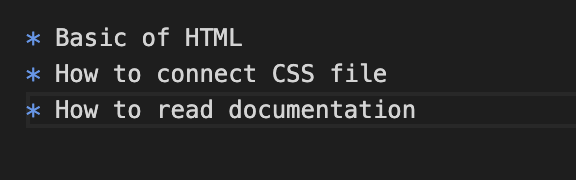

# HTML and CSS 101

#### By: Kiet Tuan Vuong

* Basic of HTML
* How to connect CSS file
* How to read documentation



``` javascript
let c = 1;
let d = 2;
let a = document.createElement('a');
a.textContent="This is", c+d
```
CSS snippet :heart_eyes:
``` css
h1 {
    background-color: red;
}
```
HTML snippet :wink:
``` html
<p>Hello world</p>
```

- [x] Wrote the first h1 tag
- [x] Connected the css to HTML file
- [] Change the background color